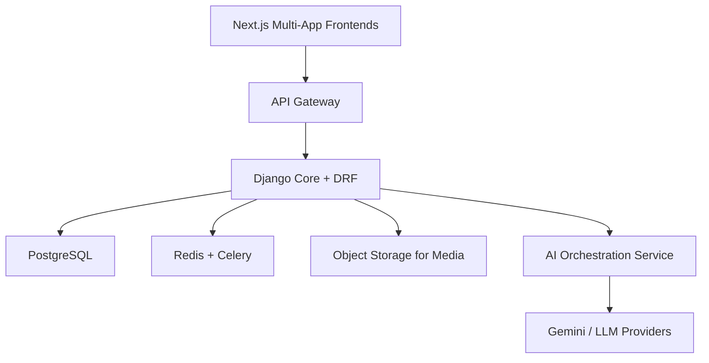

# Mejuvante AI-First Multi-Domain Ecosystem — Implementation Blueprint

## 1) Goal
Build Mejuvante as a unified AI ecosystem (not isolated websites) that combines:

- **Global AI brand authority** (`mejuvante.ai`)
- **Product-led growth platform** (AI product marketplace)
- **Regional trust and consulting credibility** (`mejuvante.com`, `mejuvante.co.in`)
- **Non-technical publishing workflows** for content/image/event management
- **Gemini-assisted content arrangement and styling**, with editorial approval

---

## 2) Platform Architecture



### Core principles

1. **Monorepo + shared design system** for speed and consistency.
2. **Domain-aware rendering** (branding, language, legal pages).
3. **Headless CMS with role-based publishing** for non-technical teams.
4. **AI assist, human approve** for all externally visible content.
5. **SEO, performance, GDPR** treated as non-negotiables.

---

## 3) Monorepo Structure (Recommended)

```txt
mejuvante-platform/
  frontend/
    apps/
      ai-site/          # mejuvante.ai
      products/         # products.mejuvante.ai
      germany-site/     # mejuvante.com
      india-site/       # mejuvante.co.in
    packages/
      ui/
      branding/
      animations/
      auth/
      cms-client/
  backend/
    core/
    apps/
      users/
      products/
      subscriptions/
      cms/
      events/
      media/
      ai_services/
      analytics/
  infra/
    docker/
    traefik/
    nginx/
    terraform/          # optional, later
  docs/
```

---

## 4) Domain Strategy

| Domain | Purpose | Primary audience | Content mode |
|---|---|---|---|
| `mejuvante.ai` | AI brand + services + thought leadership | Global users, enterprises | High-motion storytelling |
| `products.mejuvante.ai` | Product catalog + demos + subscriptions | End users + enterprise buyers | Product-first |
| `mejuvante.com` | Germany consulting (GmbH credibility) | German businesses | German-first + compliance |
| `mejuvante.co.in` | India consulting + delivery capability | Indian businesses | Professional + performance-first |

---

## 5) Non-Technical Content Management (Your key requirement)

To let non-technical people update content without code deployments:

### 5.1 CMS content model

Implement Django models (or a headless CMS equivalent) for:

- **Page**: slug, domain, language, SEO metadata, status (draft/review/published)
- **Section block**: hero, cards, testimonials, FAQ, CTA, pricing, timeline
- **Article/blog**: title, summary, cover image, tags, body blocks
- **Event**: title, date, city, registration link, speakers, banner image
- **Media asset**: file, alt text, focal point, usage metadata

### 5.2 Frontend publishing workflow

Create a content portal (admin app) with forms for:

- Upload images/files with validation and compression
- Create/edit articles and events
- Compose pages via block-based editor
- Preview on selected domain and language
- Submit for approval

### 5.3 Roles and approvals

- **Contributor**: create/edit drafts
- **Editor**: review and request changes
- **Publisher/Admin**: publish/unpublish
- **Legal reviewer** (Germany domain): compliance checks before publish

### 5.4 Versioning and rollback

- Store each page version
- Show change diffs (title/body/SEO)
- Enable one-click rollback

---

## 6) Gemini-Assisted Content + Styling (with guardrails)

Yes, Gemini can be added to assist content creation and layout. Recommended design:

### 6.1 Use cases

1. Generate page draft from prompt (e.g., “Create AI consulting landing page for automotive Germany”).
2. Rewrite text for tone: technical, executive, enterprise, startup.
3. Suggest block arrangement (hero → proof points → case studies → CTA).
4. Propose style tokens from your brand system (safe presets only).

### 6.2 Safe architecture

- Send user prompt + site/domain context + brand rules to AI service.
- AI returns **structured JSON block config**, not raw HTML.
- Backend validates schema and banned patterns.
- Editor sees preview and must approve.
- Publish only after human approval.

### 6.3 Example response contract

```json
{
  "domain": "mejuvante.ai",
  "language": "en",
  "pageType": "service-landing",
  "sections": [
    {"type": "hero", "headline": "Build Reliable Enterprise AI", "cta": "Book a Demo"},
    {"type": "proof", "items": ["Faster deployment", "Governance-first", "Measurable ROI"]},
    {"type": "case_studies", "ids": ["auto-de-01", "finops-02"]}
  ],
  "themeTokens": {"accent": "#61c4ca", "style": "dark-glow"}
}
```

### 6.4 AI governance rules

- Never auto-publish AI output.
- Require source attribution fields for factual claims.
- Flag legal/compliance-sensitive terms for review.
- Log prompts, outputs, and user approver for audit trail.

---

## 7) Frontend Implementation Notes

### 7.1 Stack

- Next.js (App Router), TypeScript, Tailwind CSS
- Framer Motion for subtle interactions
- Optional Three.js/Rive for hero scenes

### 7.2 Domain-aware runtime config

```ts
export const siteConfig = {
  "mejuvante.ai": { theme: "ai", localeDefault: "en", logo: "ai-logo.svg" },
  "products.mejuvante.ai": { theme: "ai", localeDefault: "en", logo: "ai-logo.svg" },
  "mejuvante.com": { theme: "germany", localeDefault: "de", logo: "gmbh-logo.svg" },
  "mejuvante.co.in": { theme: "india", localeDefault: "en", logo: "india-logo.svg" }
};
```

### 7.3 Rendering approach

- ISR/SSR for SEO-critical pages
- Dynamic block renderer for CMS sections
- Shared component library with theme variants

---

## 8) Backend Implementation Notes

### 8.1 Stack

- Django + DRF
- PostgreSQL
- Redis + Celery
- Storage: S3-compatible object storage for media

### 8.2 API modules

- `/api/cms/pages`
- `/api/cms/articles`
- `/api/events`
- `/api/media/upload`
- `/api/ai/generate-layout`
- `/api/ai/rewrite-content`

### 8.3 Security

- JWT auth + refresh tokens
- RBAC per domain and action
- Signed upload URLs
- Rate limits for AI endpoints

---

## 9) Germany Site Compliance Requirements

Mandatory for `mejuvante.com`:

- Cookie consent and preference center
- GDPR legal basis tracking for forms
- Impressum and Datenschutz pages
- Double opt-in for newsletters (recommended)
- Data retention and deletion workflows

---

## 10) Delivery Roadmap

### Phase 0 (1–2 weeks): Foundations

- Brand tokens, typography, spacing, motion guidelines
- Monorepo + CI/CD baseline
- Auth + RBAC scaffold

### Phase 1 (2–4 weeks): CMS + Media + Workflows

- Page/article/event/content models
- Media upload pipeline
- Review/publish workflow and audit logs
- Basic frontend block renderer

### Phase 2 (2–4 weeks): `mejuvante.ai`

- Hero + AI services + products + blog + contact
- SEO setup and schema markup
- Performance budgets

### Phase 3 (3–5 weeks): Products Platform

- Product catalog, details, demo slots
- Auth + subscriptions integration
- Usage dashboard (MVP)

### Phase 4 (2–4 weeks): Regional Sites

- Germany site with legal/compliance stack
- India site with service-focused pages

### Phase 5 (ongoing): Optimization

- Analytics, A/B testing, conversion improvements
- AI-assisted editorial tooling improvements

---

## 11) MVP Scope (Fastest path)

If you need a practical MVP quickly:

1. Build one backend + one shared UI library.
2. Launch `mejuvante.ai` first with CMS-powered pages.
3. Add articles/events and media management for non-technical users.
4. Enable Gemini only for “draft assist” + “rewrite assist”.
5. Release Germany/India sites using the same block system.

---

## 12) Immediate Next Actions

1. Approve CMS schema and publishing roles.
2. Freeze brand tokens and domain config.
3. Implement `cms`, `media`, and `ai_services` backend apps first.
4. Build a minimal editor UI for page/article/event submission.
5. Start with controlled Gemini prompts + JSON schema validation.

This gives you a scalable foundation where business teams can manage content themselves, while engineering keeps architecture clean, compliant, and future-ready.
